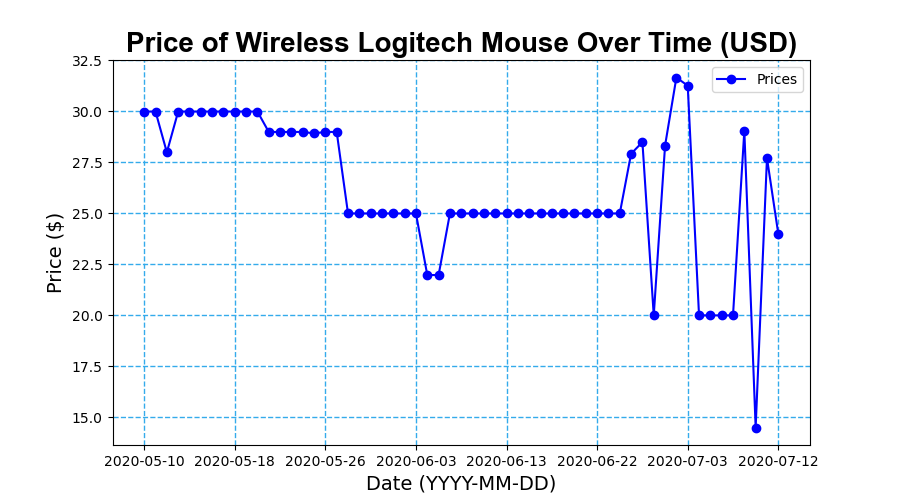

# AmazonPriceTracker
This program tracks the price of a given product on Amazon and sends me email notifications when the price drops. I used Windows Task Scheduler to run the program at a set time each day.

### Tech Stack
This project uses the following technologies:
- Python
- Selenium Web Driver
- Pandas
- Matplotlib
- SQLite
- EZ-Gmail python module

### Example of Price Chart

